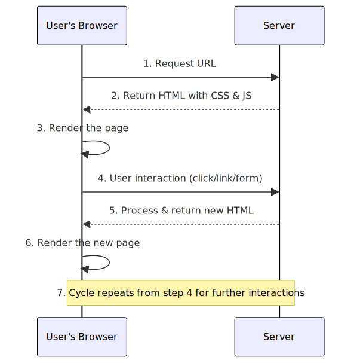

## Single Page Applications (SPA) vs Multi-Page Applications (MPA): A Comprehensive Guide

_Web applications have become an integral part of our daily lives, and the technology behind them continues to evolve. Two of the most common types of web applications are Single Page Applications (SPA) and Multi-Page Applications (MPA). This article will provide a comprehensive comparison of these two types, including their advantages, disadvantages, and use cases._

_At the AP Computer Science program (Datamatiker) at Kea, the concepts of MPAs and SPAs are introduced in the second and third semesters, respectively. These two concepts are not mutually exclusive, but to streamline your learning process, MPAs were introduced in the second semester, followed by SPA in the third._

[TOC]

## 

## What is a Multi-Page Application (MPA)?

A Multi-Page Application (MPA) is a traditional web application that loads multiple HTML pages as the user navigates through the application[ 2 ][ 3 ]. Each page in an MPA is separate and requires a full page refresh to update the content [2]. Examples of popular MPAs include Amazon, The New York Times, Wikipedia, and eBay [2].

<table>
  <tr>
   <td>
<h3>    <strong>Multi-Page Application Lifecycle</strong></h3>

<ol>

<li>User's browser requests a URL.

<li>Server processes the request and returns an HTML page with embedded CSS and JavaScript.

<li>Browser renders the page.

<li>User interacts with the page, clicking on a link or submitting a form.

<li>Browser sends a new request to the server for the next page or action.

<li>Server processes the request and returns the new HTML page.

<li>Browser renders the new page.

<li>The cycle repeats from step 4 for further user interactions.
</li>
</ol>
   </td>
   <td>

   </td>
  </tr>
</table>

### Advantages of MPAs

* **Better for Search Engine Optimization (SEO):** MPAs tend to rank well in search engine results since each page has a unique URL and can be indexed separately [2].
* **Secure:** MPAs send separate requests for each page, making it easier to implement security measures such as authentication and authorization [2].
* **Faster initial load time:** The initial load time of an MPA is often faster since the browser only needs to load the content for the current page rather than all the content for the entire application [2].
* **Compatible with older browsers:** MPA is a classic way of building web pages, so it's compatible with most older browsers and legacy systems [2].

### Disadvantages of MPAs

* **Outperformed by SPAs:** Since MPAs require a full page reload when a user interacts with the app, they offer poor performance, which negatively impacts the user experience [2].
* **Complex to develop and maintain:** MPAs are larger than SPAs and as such, take more time to develop since they consist of multiple pages [2].
* **Higher server load:** MPAs require the server to handle more requests, as each page requires a separate request to load [2].

### How you created MPA's in second semester

Perhaps you haven't encountered the term MPA before, but the web-projects you built in your second semester were actually MPAs. Spring Boot and Thymeleaf are commonly used to construct Multi-Page Applications (MPAs). In these applications, every user interaction prompts the server to render and return a new HTML page.

At a conceptual level, Spring Boot manages the application's back-end logic through an MVC (Model-View-Controller) structure. It receives HTTP requests and processes them via _controllers_, _models_, and _services_. It also retrieves data from databases using Spring Data.

In this setup, Thymeleaf was used to generate dynamic views. It integrates data from Spring Boot with HTML templates to produce a comprehensive HTML page for each request. This rendered page is then returned to the client's browser. This process repeats for every request, meaning that each interaction leads to a completely new page being sent to the client.

## What is a Single Page Application (SPA)?

A Single Page Application (SPA) is a web application that loads a single HTML page and dynamically updates the content (in the browser) as the user interacts with the application[1][2][3]. 

A SPA does not only have a single page (view), seen from the user's point of view, but will normally have multiple views or "pages". These views are then dynamically generated and swapped in and out by JavaScript running in the browser, which gives the illusion of navigating between different pages.

SPAs typically rely heavily on JavaScript frameworks such as React, Angular, and Vue to manage the application state and user interface[3]. Examples of popular SPAs include Google Maps, Gmail, Trello, Twitter, and Facebook[2].

<table>
  <tr>
   <td>
<h3>Single Page Application Lifecycle</h3>

<ol>

<li>User's browser requests a URL.

<li>Server returns the initial HTML page with CSS, JavaScript, and application. logic.Often this will be served from a separate server as visualised in the figure.

<li>The browser renders the initial page and loads the JavaScript.

<li>JavaScript fetches the initial data from the server via API calls and dynamically updates the page content.

<li>The user interacts with the page, triggering JavaScript events.

<li>JavaScript updates the page content or fetches new data from the server via API calls, if necessary.

<li>The browser updates the page content <strong>without </strong>a full-page refresh.

<li>The cycle repeats from step 5 for further user interactions.
</li>
</ol>
   </td>
   <td>

   </td>
  </tr>
</table>

### Advantages of SPAs

* **Faster loading times:** SPAs only load the necessary components once, and subsequent page updates are made dynamically without requiring a full page reload [2].
* **Great user experience:** SPAs provide a more responsive and interactive user experience, with no lag or interruptions when navigating between pages or sections [2].
* **Easier to maintain and scale:** SPAs use a modular design, making it easier to modify or replace components without impacting other parts of the application [2].
* **Offline functionality:** SPAs can display a cached version of the website so that the user can continue to use the application even when there is no internet connection [2].
* **Reduced server load:** SPAs minimise server requests because the application uses APIs to retrieve data from the server rather than requiring the server to generate an entire page for each request[ 2 ].
* **Reusable Backend Code:** SPAs typically interact with the backend through APIs. This means that the same backend and API can serve multiple types of clients, such as web, mobile, and desktop applications. This promotes code reuse and can significantly reduce development time and effort.
* **Allows for the use of modern client side frameworks** like Angular, React Vue and more

### Disadvantages of SPAs

* **Initial load time:** Since SPAs load all their content simultaneously, they can take longer to load initially [2].
* **SEO challenges:** SPAs have traditionally been difficult to optimise for search engines because they typically have only one URL and limited content on the initial page load[ 2 ].
* **Browser compatibility issues:** SPAs may not be compatible with older browsers or devices[2].
* **Security risks:** SPAs can be more vulnerable to certain types of attacks like cross-site scripting (XSS) or cross-site request forgery (CSRF) attacks due to the heavy reliance on JavaScript [2].

### How you will build SPAs on third semester

The term "Single" in Single Page Applications (SPAs) seems to indicate that there's only one page to be loaded. However, building applications like this requires additional tools, such as a module bundler ([*](https://betterprogramming.pub/javascript-module-bundlers-2a1e9307d057)), which we've omitted for simplicity. Libraries like React, Angular, and Vue typically provide a setup that handles this automatically, but we're using plain JavaScript to make it easier for you to transition to any JavaScript-based library in the real world.

We will, however, build applications that still fit the SPA description, as all HTML, CSS, and JavaScript files are loaded initially when a user lands on the page. Only then, when the user lands on the application's landing page, does the interaction begin.

As depicted in the above figure, we will also design our applications with a separate frontend and backend, deployed on different servers, similar to what is typical for SPAs. The first server, labelled "Static Web Server" above, delivers all static content initially when the user lands on the page. After that, all static HTML, CSS, and JavaScript are available for the client-side app, thanks to a modern JS feature called JS-modules. When a user navigates the page, new "pages" are generated on the fly, inside the browser, using JavaScript. When new data (not HTML) is needed, it's fetched from the API server and used by JavaScript to re-render the views.

Designing this kind of application will be one of the major topics for this semester, so many of the details will follow. For now, just make sure you understand the difference between what you did on your second semester and what we will do on your third semester (designing SPAs), ass well as the Pros and Cons with the two strategies

## 

## SPA vs MPA: Which One Should You Choose?

The choice between a SPA and an MPA should be based on the specific needs and requirements of your application. Here are some factors to consider:

* **Complexity of your application:** SPAs are well-suited for complex applications that require a high level of interactivity and real-time updates[ 2 ]. MPAs can be a good choice for applications that require a broad range of content, have significant SEO requirements, or need to leverage the strengths of server-side processing with not as much client-side processing.
* **Performance requirements:** If performance is a top priority for your application, then SPAs may be the way to go[ 2 ]. However, MPAs may be better suited for applications that require fast initial load times[ 2 ].
* **SEO requirements:** If you want your app to rank high on search engines, you can achieve this with an MPA since each page has its own unique URL, title, and metadata[ 2 ].
* **Time to market:** SPAs are easier and faster to build and as such, enable businesses to launch their products faster[ 2 ].

Also it does not have to be one or the other. You can easily combine the two, and many of the modern JS-frameworks include a mechanism to pre-render the initial pages to prevent the need for having to first load (the empty) HTML and then load the data and then re-render the page with the loaded data.

## Deployment

When it comes to deployment, both SPAs and MPAs have their unique considerations. 

### Deployment Considerations for SPAs

When deploying SPAs, it's common to have two servers: a static web server and an API server. The static web server serves the HTML, CSS, and JavaScript files, while the API server handles requests for dynamic data.

#### Advantages

* **Separation of Concerns:** Having separate servers for the static content and the API allows for a clear separation of concerns. This makes it easier to manage and scale each part of the application independently.
* **Scalability:** If your application experiences heavy traffic, you can scale the API server independently of the static content server, allowing for more efficient resource usage.
* **Reusable API**: The API server can be reused across different applications or platforms, 

#### Disadvantages

* **Complexity:** Managing two servers can add complexity to the deployment and maintenance process. You'll need to monitor and maintain two different systems, which can increase the time and resources required.
* **Cost:** Running two servers can be more expensive than running a single server, especially for smaller applications. You'll need to consider the cost of hosting, maintenance, and potentially additional development work to manage communication between the two servers.

#### Security Considerations for SPA Deployment

While separating the servers can allow for different security measures and access controls to be applied to each server, SPAs do introduce unique security challenges:

* **Token Storage:** SPAs often use tokens for authentication, which are typically stored in the client's browser. This can introduce potential security risks, as these tokens could be vulnerable to Cross-Site Scripting (XSS) attacks.
* **CORS:** The use of Cross-Origin Resource Sharing (CORS) in SPAs can pose security risks if not properly managed. For example, it can potentially expose sensitive information to malicious websites.

Therefore, when deploying an SPA, it's crucial to implement robust security measures to mitigate these risks, such as using secure methods for storing tokens, implementing proper CORS policies, and regularly updating and patching your JavaScript frameworks to protect against known vulnerabilities.

### Deployment Considerations for MPAs

MPAs typically involve server-side rendering, which means the server generates the HTML for each page. This can be done on a single server or multiple servers, depending on the application's complexity and traffic.

#### Advantages

**SEO Optimization:** Since each page is rendered server-side, it can be fully crawled and indexed by search engines, improving the application's SEO.

**Server-side Processing:** MPAs can leverage the power of the server to perform complex computations and data processing, which can offload some of the processing work from the client.

#### Disadvantages

* **Performance:** Each user interaction requires a server request, which can lead to slower load times compared to SPAs, especially for complex applications with heavy traffic.
* **Scalability:** Scaling an MPA can be more complex than scaling an SPA, as it may require load balancing across multiple servers and managing server-side sessions.
* **Development Complexity:** MPAs can be more complex to develop and maintain due to the need for server-side rendering and the larger codebase associated with multiple pages.

In conclusion, while MPAs offer advantages in terms of SEO and server-side processing, they can also introduce challenges in terms of performance, scalability, and development complexity. Therefore, it's important to carefully consider these factors when planning the deployment strategy for your MPA.

## 

## Conclusion

In conclusion, both SPAs and MPAs have their strengths and weaknesses, and the choice between the two largely depends on the specific needs and requirements of your application. It's

important to consider factors such as the complexity of your application, performance requirements, SEO needs, and time to market when making your decision. 

Lars Mortensen

KEA Fall 2023

## References

1. [SPA vs MPA: Applications, What Are The Differences?]

[https://medium.com/@theadkgroup/spa-vs-mpa-applications-what-are-the-differences-7dc004e62397](https://medium.com/@theadkgroup/spa-vs-mpa-applications-what-are-the-differences-7dc004e62397) 

2. [SPA vs MPA: Which is The King?]

[https://cleancommit.io/blog/spa-vs-mpa-which-is-the-king](https://cleancommit.io/blog/spa-vs-mpa-which-is-the-king) 

3. [Single Page Applications (SPA) Vs. Multi-Page Applications (MPA)] [https://blog.openreplay.com/single-page-apps-vs-multiple-page-apps/](https://blog.openreplay.com/single-page-apps-vs-multiple-page-apps/)
